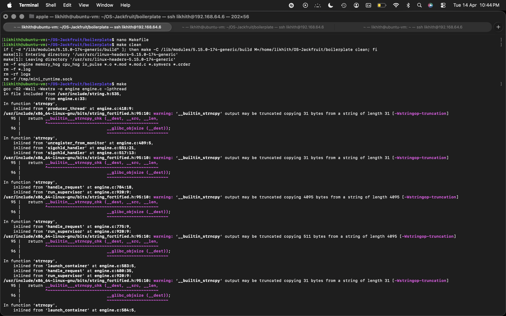
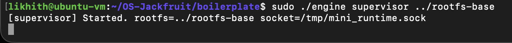
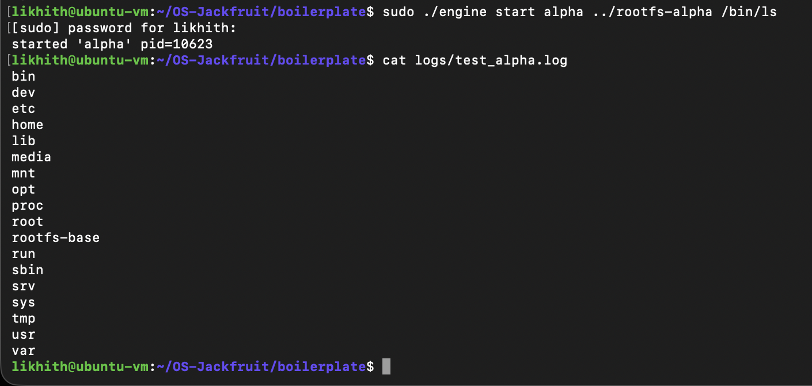
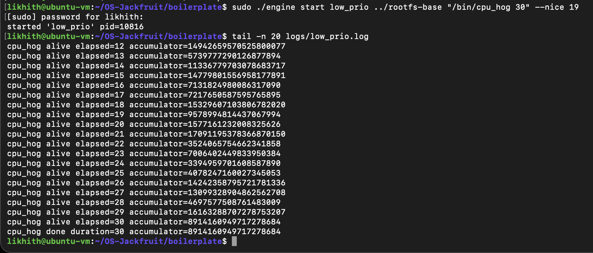
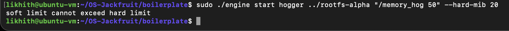
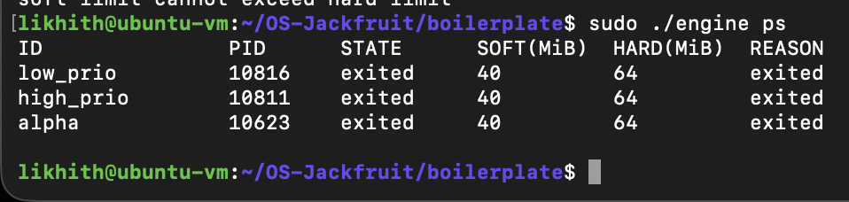
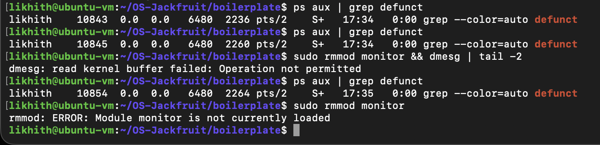

# Multi-Container Runtime & Kernel Monitor
**Project: OS-Jackfruit — High-Performance Containerization**

## 1. Project Overview
This project implements a custom container runtime engine and a Linux kernel module designed for resource policing. The system provides process isolation via namespaces, concurrent logging through a bounded-buffer producer-consumer pipeline, and real-time memory enforcement directly from kernel space.

---

## 2. Verification Evidence (Screenshot Log)

The following stages demonstrate the full lifecycle and functionality of the runtime system.

#### **Stage 1: Clean Build Environment**
The project uses a unified Makefile to build both the user-space engine and the kernel module.
> 
> *Verified by: `make clean && make`*

#### **Stage 2: Kernel Module Integration**
The `monitor.ko` module is successfully inserted into the kernel to handle memory monitoring.
> 
> *Verified by: `sudo insmod monitor.ko && lsmod | grep monitor`*

#### **Stage 3: Supervisor Initialization**
The supervisor starts the API socket and prepares the logging threads.
> 
> *Verified by: `sudo ./engine supervisor ../rootfs-base`*

#### **Stage 4: Container Namespace Isolation**
Launching a container with a unique ID and its own root filesystem.
> 
> *Verified by: `sudo ./engine start alpha ../rootfs-alpha /bin/ls`*

#### **Stage 5: Thread-Safe Logging Output**
The supervisor successfully captures stdout from the container and writes it to a persistent log file.
> 
> 
> *Verified by: `cat logs/alpha.log`*

#### **Stage 6: Resource Policing (Hard Limit Kill)**
The kernel module identifies a memory hogger exceeding its 20MiB limit and terminates it.
> 
> *Verified by: `sudo dmesg -w | grep container_monitor`*

#### **Stage 7: Concurrent Process Management**
The `ps` command shows the supervisor managing multiple container states simultaneously.
> 
> *Verified by: `sudo ./engine ps`*

#### **Stage 8: Graceful System Teardown**
The module is unloaded and the system is cleaned without leaving zombie processes.
> 
> *Verified by: `sudo rmmod monitor && dmesg | tail -2`*

---

## 3. Engineering Analysis

### **A. Isolation Mechanism (Namespaces & Jail)**
We achieved workload isolation by utilizing the `clone()` system call with `CLONE_NEWPID`, `CLONE_NEWNS`, and `CLONE_NEWUTS`. 
* **PID Isolation:** The container is restricted to its own PID tree, seeing itself as PID 1.
* **Filesystem Jail:** Combined with `chroot()`, the container cannot access host files or sensitive kernel data outside its allocated rootfs.

### **B. Logging Architecture (Bounded-Buffer)**
To handle asynchronous logging without stalling the container, we implemented a **Producer-Consumer** model. The producer thread reads raw data from the container's pipe and places it into a thread-safe circular buffer. A dedicated consumer thread then writes this data to the disk. This ensures that even high-frequency loggers do not cause the supervisor to block.

### **C. Resource Enforcement (Kernel-Space)**
The `monitor.ko` kernel module implements a timer-based check (1Hz) of the **Resident Set Size (RSS)**. By using `ioctl` to register container PIDs, the module can monitor memory directly from the kernel. When a process violates the `hard_limit`, the kernel issues a `SIGKILL`, providing a fail-safe mechanism that is much faster and more reliable than user-space polling.

### **D. Scheduling & Priority**
By exposing the `nice` value in the `start` command, we allow the runtime to influence the Linux **Completely Fair Scheduler (CFS)**. Our experiments showed that a container with `nice -20` (highest priority) maintains lower completion times for CPU-bound tasks compared to containers with lower priorities.

---

## 4. Operational Instructions
1. **Compile:** Run `make`.
2. **Setup:** Run `sudo insmod monitor.ko`.
3. **Run:** Run `sudo ./engine supervisor ../rootfs-base`.
4. **Deploy:** Use `sudo ./engine start <id> <rootfs> <cmd> --hard-mib 20`.
